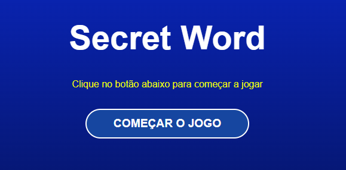
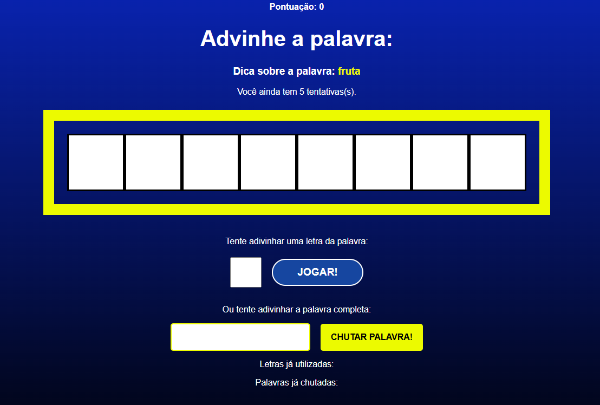
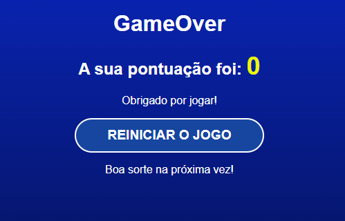

# Secret Word

Jogo de adivinhação de palavras feito com React!

## Demonstração





## Funcionalidades

- Adivinhe letras da palavra secreta
- Chute a palavra completa
- Pontuação por acertos
- Mensagem de vitória animada
- Reinício do jogo
- Exibe letras e palavras já utilizadas

## Regras do Jogo

- Você tem 5 tentativas para acertar a palavra
- Cada letra errada ou palavra errada consome uma tentativa
- Acertando todas as letras ou chutando a palavra correta, você vence a rodada
- O jogo reinicia automaticamente após vitória ou ao clicar em "Reiniciar o jogo"

## Tecnologias Utilizadas

- React
- CSS
- JavaScript

## Instalação e Execução

1. Clone o repositório:
   ```bash
   git clone https://github.com/jeffersonformigoni/secret-word.git
   ```
2. Instale as dependências:
   ```bash
   npm install
   ```
3. Rode o projeto:
   ```bash
   npm start
   ```
4. Acesse [http://localhost:3000](http://localhost:3000) no navegador

## Estrutura de Pastas

- `src/` - Código fonte principal
  - `components/` - Componentes React do jogo
  - `data/` - Lista de palavras
  - `App.jsx` - Componente principal
  - `App.css` - Estilos globais

## Contribuição

Sugestões e melhorias são bem-vindas! Abra uma issue ou envie um pull request.

## Licença

MIT

## Créditos

Desenvolvido por Jefferson Formigoni no curso Udemy React.